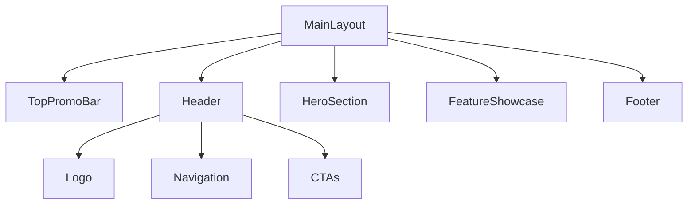

# chhlaeyTorb: All-in-One Customer Communication Platform

Build a responsive omnichannel customer communication platform that unifies chat, calls, email, and CRM functionality in one seamless interface, with a modern design using React TypeScript and Tailwind CSS.

## Features

- **Modern UI**: Clean, professional interface with a persistent topbar for promotions, centered header with navigation menu, and prominent CTA buttons for "Login", "Talk to Sales", and "Start Free Trial".
- **Component Architecture**: Modular React component structure for each main menu section (Product, Industries, Resources, Pricing).
- **Showcase Sections**: Modular content sections highlight platform capabilities, with visual elements and concise copy emphasizing the "Free Forever" value proposition.
- **Comprehensive Footer**: Includes navigation links, contact information, social media icons, and legal information, styled after respond.io.
- **Tailwind CSS v4**: Utilizes Tailwind CSS for responsive design and clean typography.

## Project Structure

- `src/components/` — Shared UI components (Header, Footer, TopPromoBar, NavMenu, etc.)
- `src/components/sections/` — Modular content sections (HeroSection, FeatureShowcase, ProductSection, etc.)
- `src/components/layout/` — Layout components (MainLayout, DashboardLayout)
- `src/pages/` — Page components (HomePage, ProductPage, IndustriesPage, etc.)
- `src/components/ui/` — UI primitives (e.g., shadcn/ui components)

## Getting Started

1. **Install dependencies:**
   ```sh
   npm install
   ```
2. **Start the development server:**
   ```sh
   npm run dev
   ```
3. **Build for production:**
   ```sh
   npm run build
   ```

## Routing

- Uses `react-router-dom` for client-side routing.
- Main routes:
  - `/` — HomePage
  - `/product` — ProductPage
  - `/industries` — IndustriesPage
  - `/resources` — ResourcesPage
  - `/pricing` — PricesPage

## Wireframes Spec



## Development Process

- **Wireframes**: Created based on PRD and mermaid diagram.
- **Component Generation**: MainLayout, HeroSection, FeatureShowcase, DashboardLayout, and all main routes are generated as modular components.
- **Responsive Design**: All components are styled with Tailwind CSS v4 for mobile-first, responsive layouts.

## License

MIT

# ChhlaeyTorb Project
